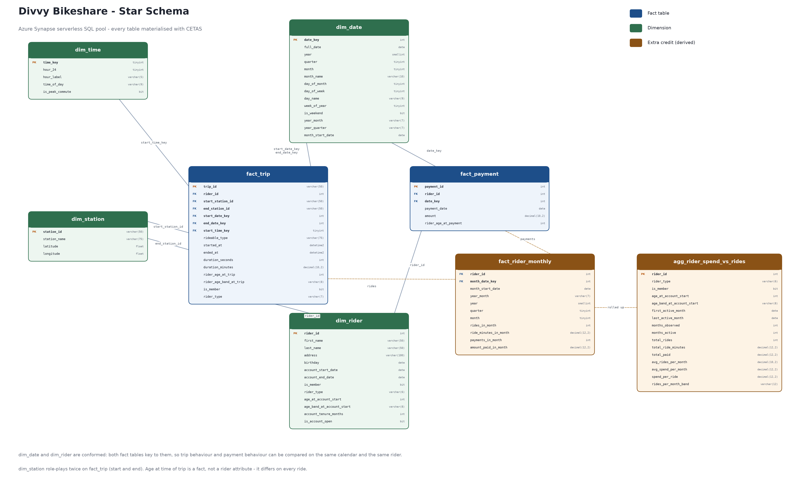
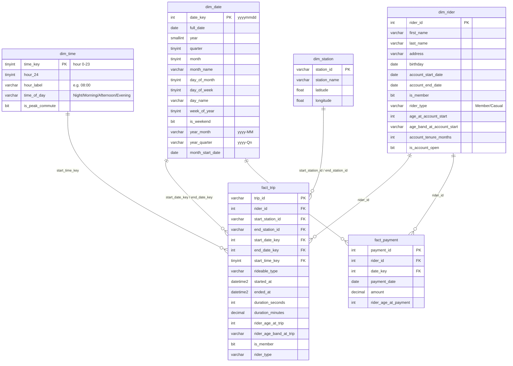

# Divvy Bikeshare — Star Schema Design

## 1. The source (what is *actually* in PostgreSQL)

The classroom ERD image shows an `account` entity and an `account_number` foreign key.
**That entity does not exist in the data.** `starter/ProjectDataToPostgres.py` creates
exactly four tables, and those four tables are what the Extract step pulls:

| table | columns (as created by the starter script) |
|---|---|
| `rider`   | `rider_id INTEGER PK, first VARCHAR(50), last VARCHAR(50), address VARCHAR(100), birthday DATE, account_start_date DATE, account_end_date DATE, is_member BOOLEAN` |
| `payment` | `payment_id INTEGER PK, date DATE, amount MONEY, rider_id INTEGER` |
| `station` | `station_id VARCHAR(50) PK, name VARCHAR(75), latitude FLOAT, longitude FLOAT` |
| `trip`    | `trip_id VARCHAR(50) PK, rideable_type VARCHAR(75), start_at TIMESTAMP, ended_at TIMESTAMP, start_station_id VARCHAR(50), end_station_id VARCHAR(50), rider_id INTEGER` |

Consequences that drive the design:

* Account membership and account lifespan are **rider attributes**, so they live on `dim_rider`.
  There is no `dim_account`.
* `payment` joins to `rider` directly on `rider_id` — not through an account number.
* `trip.rider_id` is the FK to the rider (the ERD calls it `member_id`).
* `amount` is PostgreSQL `MONEY`, so it can land in the extract as `$9.00`. It is staged as
  `VARCHAR` and cleaned during TRANSFORM.

## 2. Star schema

Two fact tables sharing conformed dimensions.

Regenerate with `python tools/render_star_schema.py`. The Mermaid source below is
kept as the machine-readable version of the same diagram.

### Fact grain

| fact | grain | measures | degenerate / role-playing |
|---|---|---|---|
| `fact_trip`    | one row per completed bike trip | `duration_seconds`, `duration_minutes`, `rider_age_at_trip` | `trip_id` (degenerate), `rideable_type`; `dim_date` role-plays as start and end date; `dim_station` role-plays as start and end station |
| `fact_payment` | one row per payment | `amount`, `rider_age_at_payment` | `payment_id` (degenerate) |

`rider_age_at_trip` is stored on the fact rather than the dimension because age is a
**point-in-time** value: the same rider has a different age on two different trips. Putting it
on the dimension would be a slowly-changing-dimension problem the project does not ask for.
`age_at_account_start` *is* stable per rider, so it lives on `dim_rider` — which is exactly
what business outcome 2b asks for.

### Key strategy

* `dim_date.date_key` — generated surrogate, `yyyymmdd` integer. Human-readable and sorts correctly.
* `dim_time.time_key` — generated surrogate, hour of day `0..23`.
* `dim_rider.rider_id`, `dim_station.station_id` — natural keys carried through from the OLTP
  source. Serverless SQL pool has no `IDENTITY` and CETAS cannot enforce a PK, so a
  `ROW_NUMBER()` surrogate would buy nothing but an extra lookup. The natural keys are already
  stable, unique, and non-reused.

## 3. Business outcomes → schema coverage

| # | Business outcome | Answered by |
|---|---|---|
| 1 | Time spent per ride | `fact_trip.duration_minutes` |
| 1a | …by day of week / time of day | `dim_date.day_name`, `dim_time.time_of_day` via `start_date_key` / `start_time_key` |
| 1b | …by start / end station | `dim_station` joined twice on `start_station_id`, `end_station_id` |
| 1c | …by rider age at time of the ride | `fact_trip.rider_age_at_trip`, `rider_age_band_at_trip` |
| 1d | …by member vs casual | `fact_trip.is_member` / `fact_trip.rider_type` (carried onto the fact so the question needs no join) |
| 2 | Money spent | `fact_payment.amount` |
| 2a | …per month, quarter, year | `dim_date.year`, `quarter`, `month`, `year_month`, `year_quarter` |
| 2b | …per member by age at account start | `dim_rider.age_at_account_start`, `age_band_at_account_start` |
| 3 | **EXTRA CREDIT** — money per member vs rides averaged per month | `fact_rider_monthly` (rider × month grain) and `agg_rider_spend_vs_rides` (rider grain, `avg_rides_per_month` + band) |

## 4. Extra credit tables

`fact_rider_monthly` — grain: one row per rider per calendar month that the rider was active.
Conforms rides and payments onto the same grain so they can be compared without a fan-out join.

| column | meaning |
|---|---|
| `rider_id` | grain: the rider |
| `month_date_key` | `yyyymm01` int, joins to `dim_date` on the first of the month |
| `month_start_date` | first day of the month, as a date |
| `year_month` | `yyyy-MM` label |
| `year`, `quarter`, `month` | calendar parts, so the fact can be sliced without a join |
| `rides_in_month` | count of trips started that month |
| `ride_minutes_in_month` | total ride minutes that month |
| `payments_in_month` | count of payments dated that month |
| `amount_paid_in_month` | sum of payments dated that month |

`agg_rider_spend_vs_rides` — grain: one row per rider. Rolls the monthly fact up to lifetime
totals and computes `avg_rides_per_month`, plus a banding column so the answer to
"how much money is spent per member based on how many rides they average per month" is a
single `GROUP BY`.

| column | meaning |
|---|---|
| `rider_id` | grain: the rider |
| `rider_type`, `is_member` | carried from `dim_rider` so the rollup needs no join |
| `age_at_account_start`, `age_band_at_account_start` | carried from `dim_rider` |
| `first_active_month`, `last_active_month` | bounds of the observation window |
| `months_observed` | months from first to last activity, inclusive — the denominator |
| `months_active` | months in which the rider actually rode |
| `total_rides`, `total_ride_minutes`, `total_paid` | lifetime totals |
| `avg_rides_per_month` | `total_rides / months_observed` |
| `avg_spend_per_month` | `total_paid / months_observed` — tenure-neutral |
| `spend_per_ride` | `total_paid / total_rides` — the headline measure |
| `rides_per_month_band` | banding of `avg_rides_per_month`, so the answer is one `GROUP BY` |
